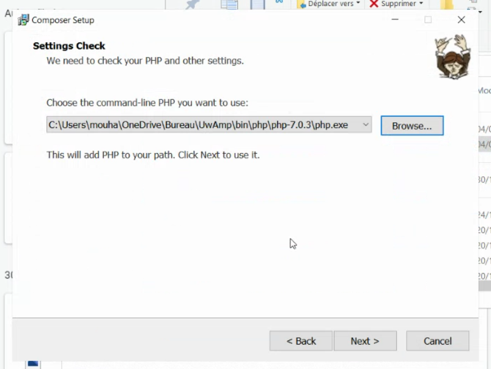

## Lundi 2021/01/04

Début du php !!

### Présentation 

* PHP = logiciel ET un langage
* par ex sur windows : le logiciel est php.exe
* le langage reste "PHP"

au départ ça voulait dire Personal Home Page le but c'était de générer du HTML
exactement le meme but que lorsqu'on créait des innerHTML en javascript

On crée un fichier "index.php" !

```php
<?php
  echo "premier code php";
?>
```
### Installation

1. Ouvrir le terminal intégré dans vscode
2. Taper `php -v`  (le v est en minuscule, et notez l'espace) 

pour ceux qui ont des windows, ça ne devrait pas marcher, pour les autres (mac, linux...) ça devrait le faire

comment faire pour les windowsiens ?

=> https://getcomposer.org/doc/00-intro.md#using-the-installer
getcomposer.orggetcomposer.org
Introduction - Composer
A Dependency Manager for PHP

on va installer "composer" (on s'en servira plus tard), et il va nous rendre php accessible partout



options par défaut, sauf le "PATH" de php

exemple de chemin vers php pour les windows : C:/wamp64/bin/php7.2/php.exe

ensuite fermer vscode et le rouvrir, puis refaire php -v

https://www.wampserver.com/

#### Intelephense


### Code

plusieurs choses :

1. les variables commencent par des "$" en php (ici en js on aurait : let var = "texte";
2. les instructions se terminent par un ";" !!!!!!!
3. en js on aurait : `let bonjour = "Bonjour " + nom;` donc la concaténation des chaines de caractères en php se fait avec le "."

Exécution :

`php le_nom_du_script.php`

avec un espace entre php et `le_nom_du_script.php`.

Vu :

* tableaux
* boucles
* conditions
* tableaux associatifs

## Mardi 2021/01/05

### Exercice pour s'entraîner pour les fonctions

Afficher un tableau sous forme de texte.

But : utiliser uniquement les fonctions que je fournissais

### Correction ? (voir fichiers associés)

en js on faisait `res += "toto"` pour concaténer 2 strings, ici on fait `$res .= "toto";`

c'est égal à `res = res + "toto"`, et `"$res = $res . "toto";`

étape 1 du déroulement du code :

```php
$tbl .= ajouteSautDeLigne(genCol(majuscule($eleve["nom"])) . genCol(minuscule($eleve["prenom"])));
```

étape 2 du déroulement :

```php
$tbl .= ajouteSautDeLigne(genCol(majuscule("kim")) . genCol(minuscule("sangoku")));
```

étape 3 :

```php
$tbl .= ajouteSautDeLigne(genCol("KIM") . genCol("sangoku"));
```

étape 4 :

```php
$tbl .= ajouteSautDeLigne("KIM|" . "sangoku|");
```

étape 5 :

```php
$tbl .= ajouteSautDeLigne("KIM|sangoku|");
```

étape 6 :

```php
$tbl .= "KIM|sangoku|\n";
```

étape 7 :

```php
$tbl = $tbl . "KIM|sangoku|\n";
```

alors

```php
// si $tbl = "==========\n";
// alors
// => donc $tbl est égal à "==========\nKIM|sangoku|\n"
```

si je fais ensuite

```php
echo $tbl;
```

alors ça affiche :

```
==========
KIM|sangoku|
```

si je vous mets la meme chose formatée un peu mieux :

```php
$tbl .= ajouteSautDeLigne(
            genCol(
                majuscule(
                    $eleve[
                        $colonnes[0]
                    ]
                )
            ) . genCol(
                minuscule(
                    $eleve[
                        $colonnes[1]
                    ]
                )
            )
        );
```

il reste à faire

```php
afficheDansLeTerminal($tbl);
```

