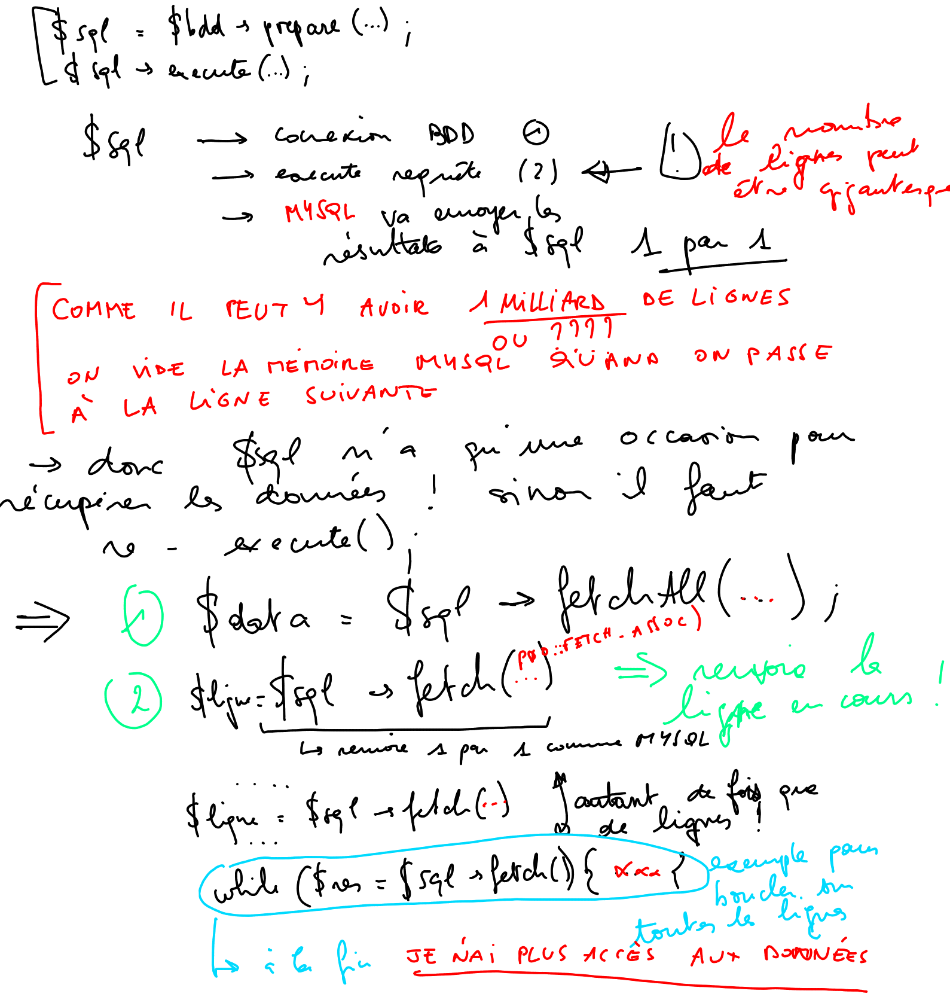

## Jeudi 2021/01/21

### MCD + Contraintes / Relations

Explications MCD / Merise, notamment la différence entre les relations (MCD) et leur traduction en MPD/SQL : les contraintes.

### PHP PDO

Explications fonctionnement requêtage de BDD avec PDO et php.

* requetes
* requetes préparées
...

### POO : Programmation orientée objet

