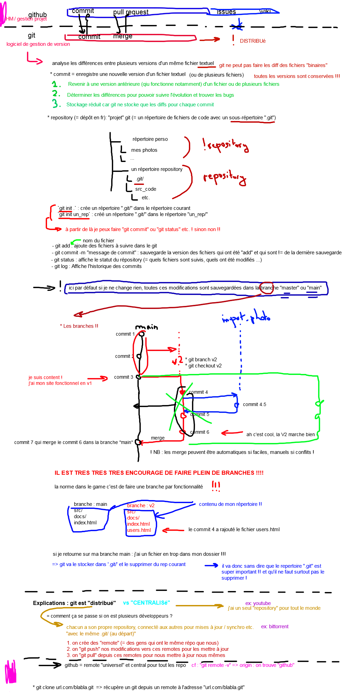

# Git

## Ajouter un fichier dans .gitignore

Permet de ne jamais le commiter, même s'il est modifié.

### Contenu du fichier .gitignore

Si on veut ignorer `.env.local` et le répertoire `vendor` et tous les fichiers `.tmp` :

```
//.env.local
vendor/
*.tmp
.env.*
```


